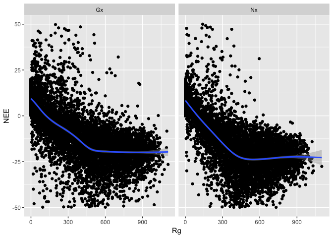

NEE versus Rg - Comparing Nouragues to Paracou
================
Bruno Hérault
5/2/2018

-   [Loading Data](#loading-data)
-   [The basic Michaelis-Menten model](#the-basic-michaelis-menten-model)
-   [Testing for a site effect on model parameters](#testing-for-a-site-effect-on-model-parameters)
-   [Predictions](#predictions)
-   [Conclusions](#conclusions)
    -   [Materials & Methods](#materials-methods)

Loading Data
============

``` r
library(ggplot2)
data<-read.table(file="data.txt", header = TRUE, sep = "", dec = ".")
ggplot(data, aes(Rg, NEE)) +
  geom_point() +
  geom_smooth() +
  facet_wrap(~site)
```

    ## `geom_smooth()` using method = 'gam'



The basic Michaelis-Menten model
================================

Testing for a site effect on model parameters
=============================================

Predictions
===========

Conclusions
===========

Materials & Methods
-------------------
