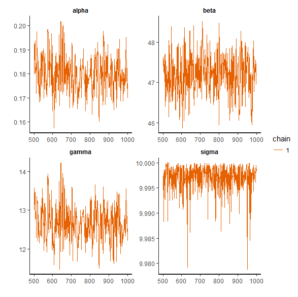
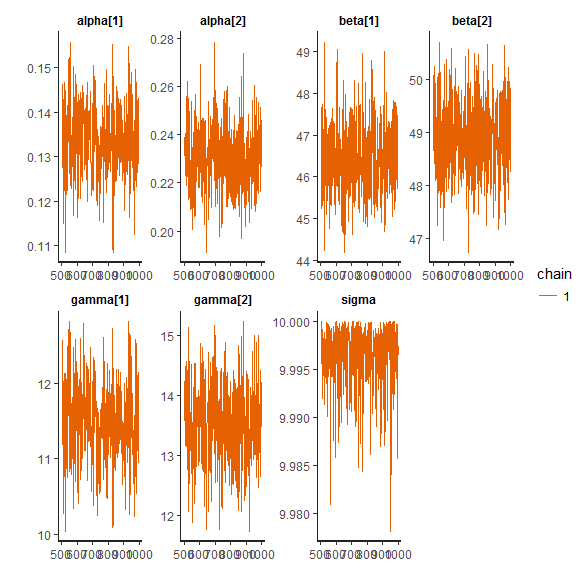

NEE versus Rg - Comparing Nouragues to Paracou
================
Bruno Hérault
5/2/2018

-   [Loading Data](#loading-data)
-   [The basic Michaelis-Menten model](#the-basic-michaelis-menten-model)
-   [Testing for a site effect on model parameters](#testing-for-a-site-effect-on-model-parameters)
-   [Predictions](#predictions)
-   [Conclusions](#conclusions)

We then compared the light response curve of NEE at the two sites. Empirical description of the measured NEE fluxes was performed with a non-linear least squares fit of the data to a hyperbolic light response model, also known as the Michaelis-Menten or rectangular hyperbola model (Owen et al., 2007). NEE = -(α*β*Rg)/(α\*Rg+β)+γ Where α is the initial slope of the curve and an approximation of the canopy light utilization efficiency, β is the maximum NEE of the canopy at light saturation, Rg is the global radiation and γ is an estimate of the average ecosystem respiration (Reco) occurring during the observation period.

Loading Data
============

``` r
library(ggplot2) 
data<-read.table(file="data.txt", header = TRUE, sep = "", dec = ".") 
datDAY<-dat[dat$Rg>5,]
## keeping only daytime values (Rg>5) for the analysis
ggplot(datDAY, aes(Rg, NEE)) + geom_point() + geom_smooth() + facet_wrap(~site) 
```

    ## `geom_smooth()` using method = 'gam'


The basic Michaelis-Menten model
================================

$$NEE =-\\frac{\\alpha \\times \\beta \\times Rg}{\\alpha \\times Rg + \\beta} + \\gamma $$

``` r
library(rstan)
```

    ## Loading required package: StanHeaders

    ## rstan (Version 2.17.3, GitRev: 2e1f913d3ca3)

    ## For execution on a local, multicore CPU with excess RAM we recommend calling
    ## options(mc.cores = parallel::detectCores()).
    ## To avoid recompilation of unchanged Stan programs, we recommend calling
    ## rstan_options(auto_write = TRUE)


# Running stan analysis with only daytime values
datStan<-list(N=11825, T=2, NEE=datDAY$NEE, Rg=datDAY$Rg, site=as.numeric(datDAY$site))

fitM0 <- stan(file = 'mich0.stan', data = datStan, iter = 1000, chains = 1)

fitM1 <- stan(file = 'mich1.stan', data = datStan, iter = 1000, chains = 1)

traceplot(fitM0, pars=c("alpha", "beta", "gamma", "sigma"), nrow=2)

traceplot(fitM1, pars=c("alpha", "beta", "gamma", "sigma"), nrow=2)

parM1<-summary(fitM1)$summary[,1]
parM1

parM0<-summary(fitM0)$summary[,1]
parM0

 parM1
     alpha[1]      alpha[2]       beta[1]       beta[2]      gamma[1] 
 1.331696e-01  2.308650e-01  4.647212e+01  4.892123e+01  1.147118e+01 
     gamma[2]         sigma          lp__ 
 1.354232e+01  9.996811e+00 -3.466974e+04 


From this model, it looks like

**alphas are different, with a lower canopy light utilisation efficiency (0.17-0.15) at Guyaflux than at Nouraflux (0.20-0.26)**

**betas are not different, with the maximum NEE of the canopy at light saturation similar between the two sites (44.9-50.3)**

**gammas are slightly different, with the average ecosystem respiration lower at Guyaflux (10.4-12.6) than at Nouraflux (12.1-14.9)**


Running the same analysis with only daytime values (Rg>5)
=============================================

``` r
datStan<-list(N=11825, T=2, NEE=datDAY$NEE, Rg=datDAY$Rg, site=as.numeric(datDAY$site))
fitM0 <- stan(file = 'mich0.stan', data = datStan, iter = 1000, chains = 1)
fitM1 <- stan(file = 'mich1.stan', data = datStan, iter = 1000, chains = 1)
traceplot(fitM0, pars=c("alpha", "beta", "gamma", "sigma"), nrow=2)
```



``` r
traceplot(fitM1, pars=c("alpha", "beta", "gamma", "sigma"), nrow=2)
``` 



``` r
parM1<-summary(fitM1)$summary[,1] 
parM1
 
##     alpha[1]      alpha[2]       beta[1]       beta[2]      gamma[1] 
## 1.334086e-01  2.308565e-01  4.647125e+01  4.884585e+01  1.149438e+01 
##    gamma[2]         sigma          lp__ 
## 1.350143e+01  9.996766e+00 -3.466933e+04 
```

* From this model, it looks like:

(1) alphas are different, with a lower canopy light utilisation efficiency (0.13-0.17) at Guyaflux than at Nouraflux (0.24-0.32)

(2) betas are slightly different, with the maximum NEE of the canopy at light saturation lower at Guyaflux (43.5-45.4) than at Nouraflux (46.1-49.5)

(3) gammas are slightly different, with the average ecosystem respiration lower at Guyaflux (9.3-12.1) than at Nouraflux (12.4-16.3)


Predictions
===========

Conclusions
===========
