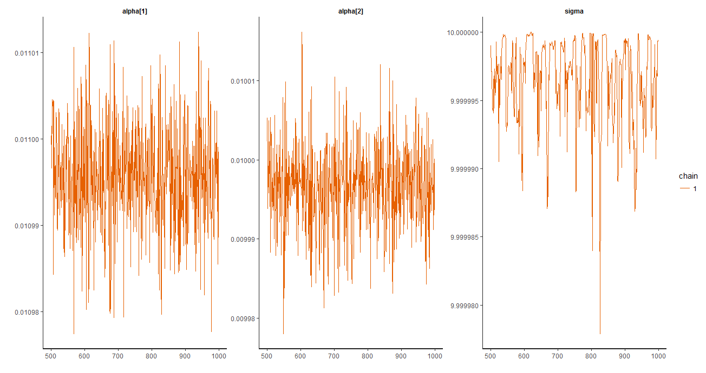

Comparison of relationship between LE and VPD in both ecosystems with Bayesian estimates of the parameters following the theoretical equation between LE and VPD:
LE =𝐿 ∗𝑔𝑡𝑜𝑡 ∗𝑉𝑃𝐷/𝑃𝑎
Where L is the latent heat of vaporization that depend on air temperature (L ~ -0.0019T - 2.2366T + 2499.5 at ambient pressure)
And gtot is the total canopy conductance of the ecosystem (in mgH2O m-2 s-1)



``` r
summary(fitM3)$summary[,1]
     alpha[1]      alpha[2]         sigma          lp__ 
 1.099568e-02  9.996707e-03  9.999997e+00 -1.238005e+06 
```

**gtot is different in the two sites with a higher canopy conductance at Guyaflux (10.98-11.00) than at Nouraflux (9.98-10.00)
